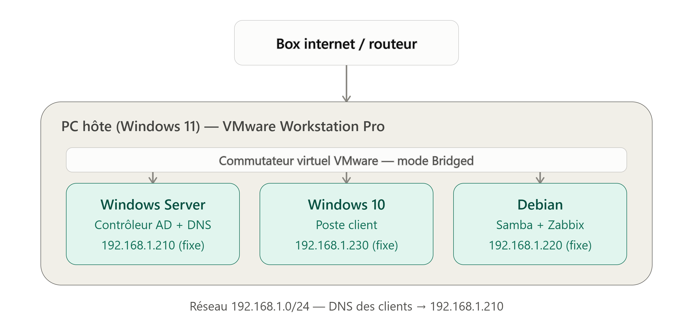
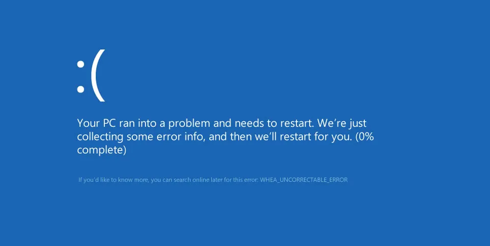

# Lab 1.1 — Installation et configuration d'un hyperviseur
 
## Objectif
 
Mettre en place un environnement de virtualisation permettant d'héberger toutes les futures machines virtuelles du homelab (Windows Server, poste client, Linux), directement sur mon PC principal. Il s'agit de la brique de base sur laquelle reposent tous les labs suivants (1.2 à 1.9).
 
J'ai choisi **VMware Workstation Pro** comme hyperviseur unique pour tout le homelab (plutôt que de faire cohabiter Hyper-V et VMware sur la même machine, ce qui pose des conflits d'accès à la virtualisation matérielle du CPU).
 
## Matériel et prérequis
 
- PC principal — Intel Core i7-11700K, 32 Go RAM, virtualisation matérielle (VT-x) activée dans le BIOS
- Stockage des VM sur disque dur (HDD), 400 Go d'espace libre
- VMware Workstation Pro 26H1 (gratuit en usage personnel)
- ISO Windows Server 2025 Standard Evaluation (Expérience utilisateur), ISO Windows 10 Pro 22H2, ISO Debian 13 "Trixie" (netinst)
- Réseau virtuel en mode **Pont (Bridge)**

## Étapes réalisées
 
1. Vérification et activation de la virtualisation matérielle (VT-x) dans le BIOS
2. Installation de VMware Workstation Pro sur le PC principal, licence personnelle gratuite
3. Installation de la VM **Windows Server 2025** — sans difficulté particulière
4. Installation de la VM **Debian 13** en ligne de commande (sans interface graphique), également sans difficulté majeure une fois l'ISO correctement montée
5. Tentative d'installation d'une VM **Windows 11 Pro** comme poste client — plusieurs blocages rencontrés (détaillés ci-dessous), non résolus malgré de nombreux ajustements
6. Décision de **basculer sur Windows 10 Pro** pour le poste client, installation réussie sans difficulté
7. Prise d'un **snapshot** sur chacune des 3 VM une fois les installations stabilisées

## Difficultés rencontrées
 
### Tentative Windows 11 (abandonnée)
 

- **Erreur WHEA_UNCORRECTABLE_ERROR** récurrente pendant l'installation, à des étapes et pourcentages différents à chaque tentative
- Pistes explorées sans succès durable : désactivation de l'accélération 3D, réduction de la RAM/du nombre de vCPU, désactivation du TPM virtuel et du Secure Boot (contournement via profil "Windows 10 x64" à la création + clé de registre `LabConfig` pendant l'installation), vérification de l'intégrité de l'ISO (hash SHA256 correct), vérification de la sécurité basée sur la virtualisation sur l'hôte (désactivée, donc non responsable), désactivation de la mise en veille du PC hôte pendant l'installation
- Un plantage a été confirmé lié à la mise en veille du PC hôte pendant l'installation (disque virtuel corrompu après une phase d'écriture interrompue), corrigé pour cette cause précise — mais l'erreur WHEA est réapparue ensuite pour d'autres raisons non identifiées
- **Décision** : plutôt que de s'acharner sur un problème non résolu après de nombreuses heures de dépannage, j'ai choisi de basculer sur **Windows 10 Pro** pour le poste client, qui remplit exactement le même rôle dans le lab (jonction au domaine Active Directory, tests GPO, permissions) sans nécessiter les mêmes prérequis matériels stricts (TPM 2.0, Secure Boot, 2 cœurs minimum)
### Windows 10 (solution retenue)
 
- Installation sans blocage matériel, mais nécessité de contourner la création forcée d'un compte Microsoft en ligne pendant l'installation (utilisation de la commande `ms-cxh:localonly` pour obtenir directement un compte local)

### Debian
 
- Oubli initial de spécifier le chemin de l'ISO dans les paramètres de la VM, provoquant un échec de démarrage réseau (PXE) — corrigé en vérifiant le montage de l'ISO dans les paramètres CD/DVD
- Après l'installation, échec de connexion avec l'identifiant utilisateur malgré un mot de passe apparemment correct — résolu en se connectant d'abord en root pour réinitialiser le mot de passe utilisateur via `passwd`
## Ce que j'ai retenu
 
- Une erreur WHEA côté VM ne provient pas nécessairement d'un vrai problème matériel de l'hôte : elle peut être générée par l'hyperviseur lui-même sans que rien n'apparaisse dans les journaux d'événements Windows de l'hôte — un point qui peut facilement induire en erreur lors du diagnostic
- Savoir **abandonner une piste après un dépannage méthodique et raisonnable**, plutôt que de s'acharner indéfiniment : Windows 10 remplissait le besoin du lab tout aussi bien que Windows 11
- L'importance de désactiver la mise en veille du PC hôte avant toute installation longue ou manipulation sensible sur une VM, pour éviter toute corruption
- Toujours vérifier le montage effectif d'une ISO avant de démarrer une VM, plutôt que de supposer que le chemin a été correctement renseigné
- Sous Linux, une erreur de connexion peut se résoudre simplement en se connectant en root pour réinitialiser le mot de passe concerné, sans réinstaller quoi que ce soit
- Prochaine étape (lab 1.2) : déployer Active Directory sur la VM Windows Server et joindre le poste client Windows 10 au domaine