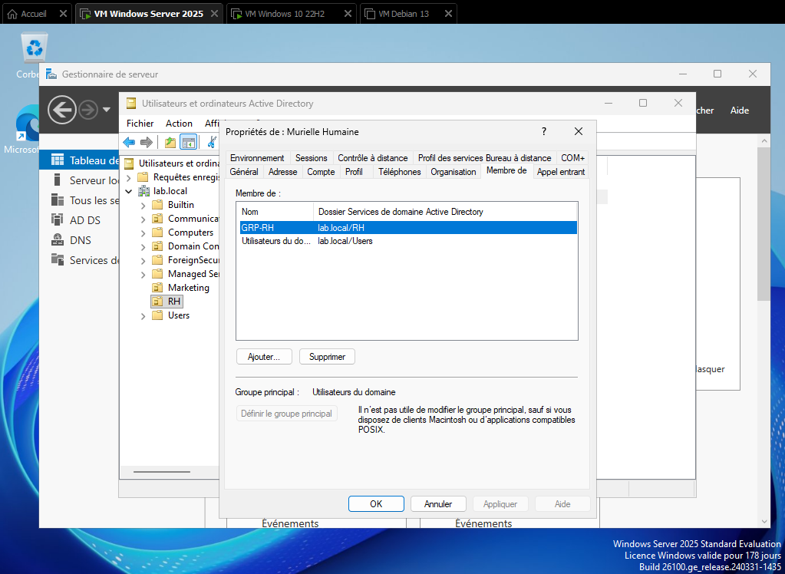
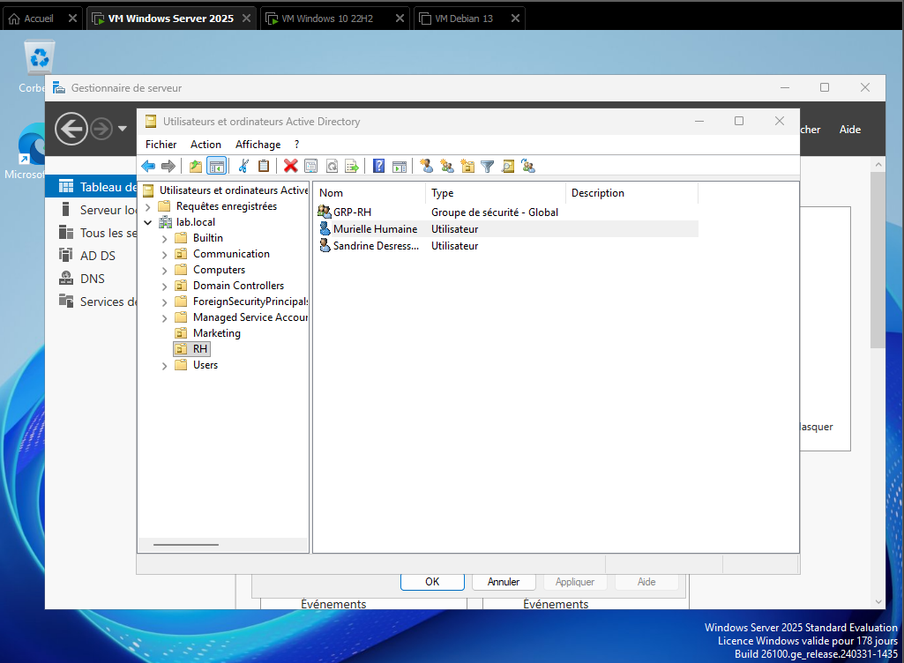
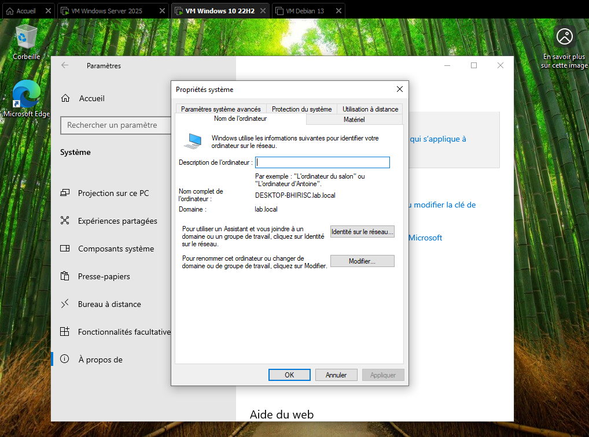

# Lab 1.2 — Active Directory

## Objectif

Installer le rôle Active Directory Domain Services (AD DS) sur la VM Windows Server, promouvoir le serveur en contrôleur de domaine (`lab.local`), créer les unités d'organisation (OU) et les utilisateurs correspondant aux services RH, Marketing et Communication, puis joindre le poste client Windows 10 au domaine.

## Étapes réalisées

1. Configuration d'une IP fixe sur la VM Windows Server, DNS pointé sur elle-même (127.0.0.1)

2. Installation du rôle **AD DS** (Active Directory Domain Services) via le Gestionnaire de serveur

3. Promotion du serveur en contrôleur de domaine, création d'une nouvelle forêt `lab.local`

4. Création des unités d'organisation (OU) **RH**, **Marketing** et **Communication** dans Utilisateurs et ordinateurs Active Directory

5. Création d'un groupe de sécurité par OU, puis de plusieurs utilisateurs par service, rattachés à leur groupe correspondant





6. Configuration du DNS de la VM Windows 10 vers l'IP du contrôleur de domaine, puis jonction du poste au domaine `lab.local`



7. Test de connectivité entre les VM via la commande `ping` (réseau en mode Pont/Bridge)

8. Test de connexion sur le poste Windows 10 avec un compte de domaine créé précédemment


## Difficultés rencontrées

- **Crash récurrent avec le code erreur WHEA**, dès la première manipulation dans Active Directory — le même type d'erreur que celui rencontré lors de la tentative d'installation de Windows 11 au lab précédent. Après plusieurs heures de recherche et de débogage :

- Première piste résolue : configurer le CPU virtuel de façon plus proche de celui du PC hôte. Dans mon cas, passer de 2 processeurs à 1 cœur chacun, à **1 processeur avec 4 cœurs**, a nettement amélioré la stabilité

- Cause réelle identifiée : WHEA signalant une erreur matérielle, je me suis penché sur la lecture/écriture mémoire des VM. Mes machines virtuelles étaient configurées avec un **contrôleur de disque virtuel NVMe**, alors qu'elles sont physiquement hébergées sur un **disque dur (HDD)**, et non un SSD NVMe. Une fois le contrôleur de disque corrigé pour correspondre au matériel réel de l'hôte, plus aucun crash ni bug n'est survenu

- **Décision de conserver Windows 10 plutôt que de retenter Windows 11** : ayant déjà perdu beaucoup de temps sur les précédents blocages (lab 1.1), et Active Directory fonctionnant de manière identique sur les deux systèmes (jonction au domaine, GPO, permissions), retenter Windows 11 n'apportait pas de valeur ajoutée suffisante pour justifier le risque de nouveaux blocages

- **Ping entre VM sans réponse** ("délai d'attente dépassé") malgré un réseau en mode Pont/Bridged. Après des recherches, je découverte que **Windows bloque par défaut les réponses ping** (ICMP) via son pare-feu intégré, indépendamment de la connectivité réseau réelle. Résolu avec la commande PowerShell :

```powershell

New-NetFirewallRule -DisplayName "Autoriser Ping" -Direction Inbound -Protocol ICMPv4 -Action Allow

```

## Ce que j'ai retenu

- Une erreur WHEA sur une VM peut être causée par une **incohérence entre la configuration virtuelle et le matériel réel de l'hôte** (type de contrôleur de disque, répartition CPU/cœurs) — un point qui n'est pas évident à diagnostiquer puisque l'erreur semble purement logicielle au premier abord

- Savoir **arbitrer entre s'acharner sur un problème et avancer avec une alternative équivalente** : Windows 10 remplissait exactement le même besoin qu'un Windows 11 pour cette étape

- Un `ping` sans réponse ne signifie pas toujours un problème réseau — cela peut simplement être un pare-feu qui bloque le protocole ICMP par défaut, un comportement standard sur Windows qu'il faut connaître pour ne pas perdre de temps à chercher du côté du réseau physique/virtuel

- Après la jonction du Windows 10 au domaine, je n'avais plus accès à mon **compte administrateur local** depuis l'écran de connexion (le domaine prenant le pas par défaut). Il n'est pas nécessaire d'ajouter ce compte local dans Active Directory : il suffit de préfixer l'identifiant par `.\` (ex : `.\Administrateur`) pour indiquer à Windows de basculer sur l'authentification locale de la machine plutôt que sur le domaine

- Prochaine étape (lab 1.3) : mise en place des stratégies de groupe (GPO) sur les OU créées

