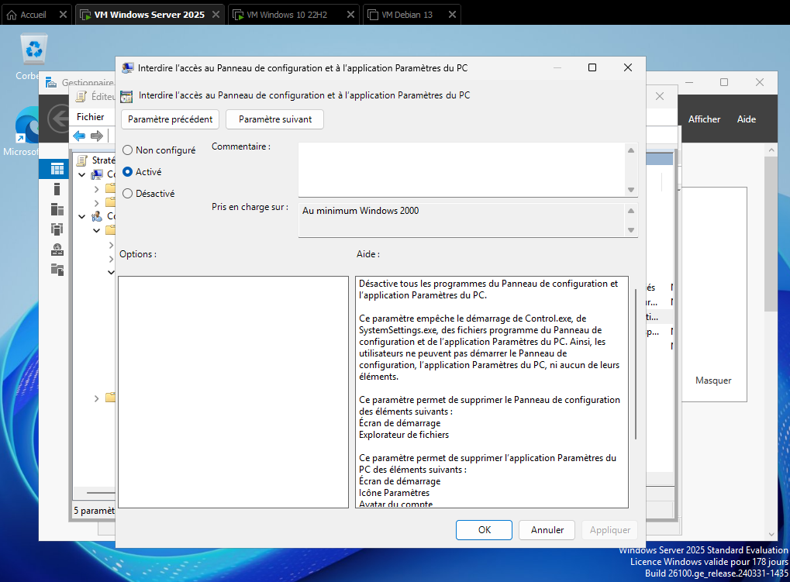
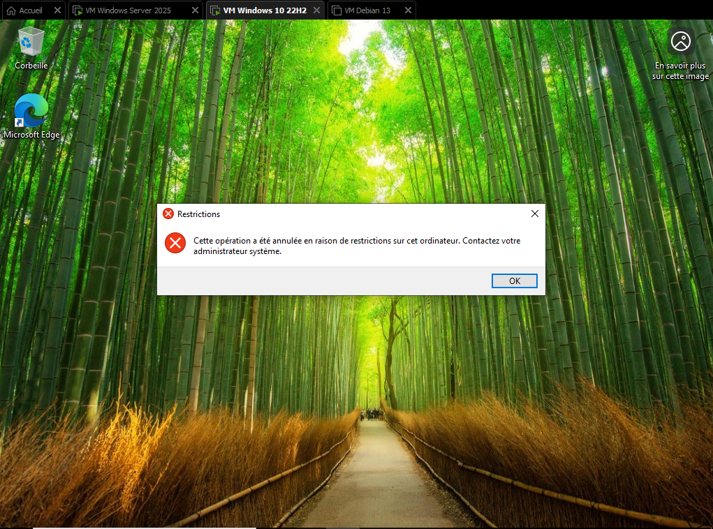
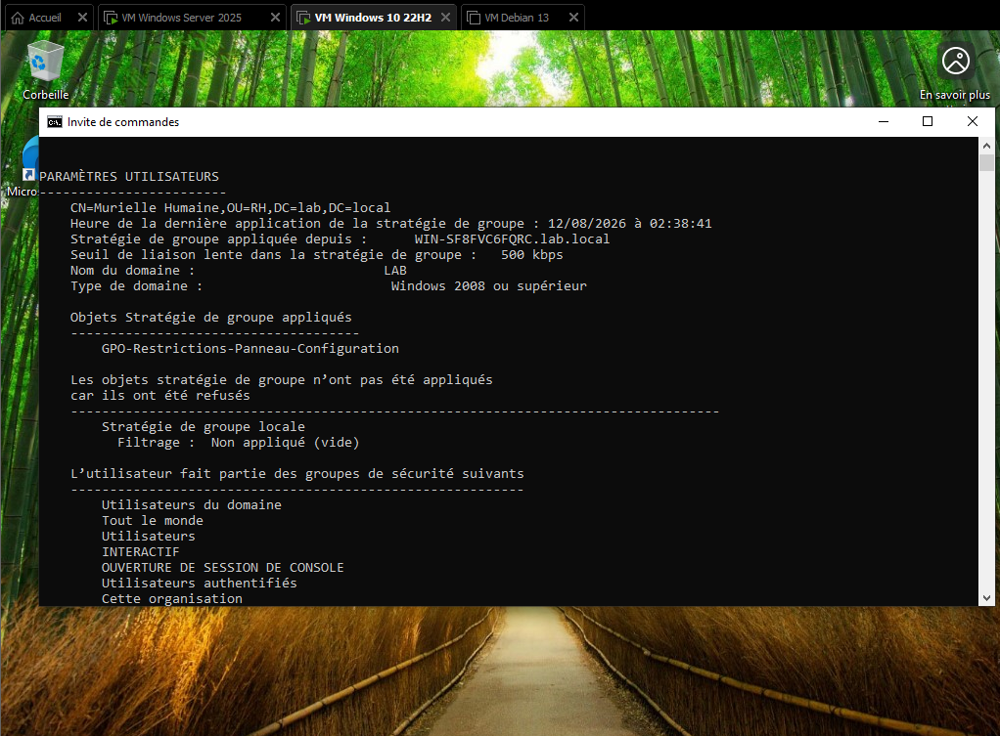
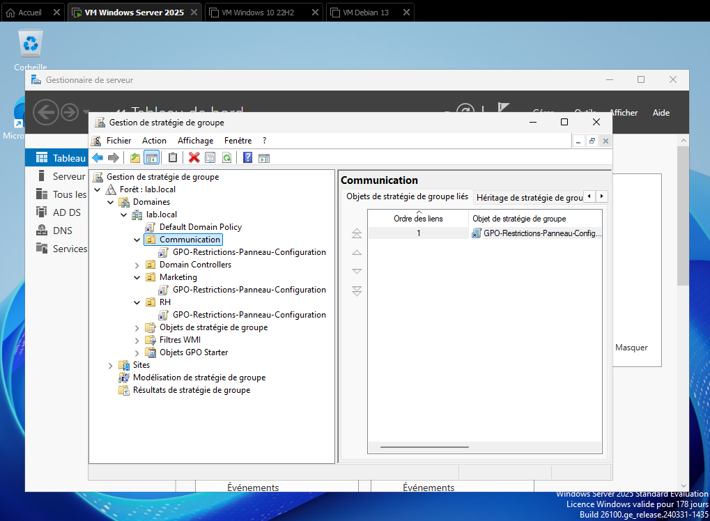

# Lab 1.3 — Stratégies de groupe (GPO)

## Objectif

Mettre en place des stratégies de groupe (GPO) liées aux unités d'organisation créées au lab 1.2 (RH, Marketing, Communication), afin d'appliquer automatiquement des règles et configurations différenciées selon le service de l'utilisateur connecté, et vérifier leur bonne application sur le poste client.

## Étapes réalisées

1. Ouverture de la console de gestion des stratégies de groupe (`gpmc.msc`) sur la VM Windows Server

2. Création d'une GPO liée à l'OU RH (`GPO-Restrictions-Panneau-Configuration`)

3. Configuration d'une première règle simple sous Configuration utilisateur (restriction d'accès au Panneau de configuration)

4. Application forcée de la GPO via `gpupdate /force` sur le serveur

5. Test depuis la VM Windows 10, avec une reconnexion sur un compte utilisateur de l'OU RH pour vérifier l'application de la règle

6. Vérification de l'application effective des GPO via `gpresult /r` et `gpresult /h rapport.html`

7. Extension de la GPO `GPO-Restrictions-Panneau-Configuration` aux OU Marketing et Communication, en plus de RH

## Difficultés rencontrées

Aucune difficulté particulière rencontrée sur ce lab — les GPO se sont créées, liées et appliquées sans blocage.

## Ce que j'ai retenu

- La logique de liaison d'une GPO à une OU précise, plutôt qu'au domaine entier, permet d'appliquer des règles différenciées par service sans affecter les autres OU

- `gpupdate /force` évite d'attendre le cycle d'actualisation automatique des GPO (jusqu'à 90 minutes) pendant les phases de test

- `gpresult` est l'outil de référence pour diagnostiquer si une GPO s'applique réellement à un utilisateur ou un poste donné, plutôt que de se fier uniquement à une vérification visuelle

- **À reprendre plus tard** : je reviendrai sur ce lab au moment du lab 1.6 (serveur de fichiers) pour mettre en place des GPO de lecteurs mappés automatiques par service, une fois le partage Samba configuré sur la VM Debian

- **À reprendre plus tard également** : mise en place d'une GPO (`GPO-Restrictions-Arriere-Plan`) restreignant la modification de l'arrière-plan des postes de travail par les utilisateurs, avec une image d'arrière-plan imposée directement depuis la GPO

