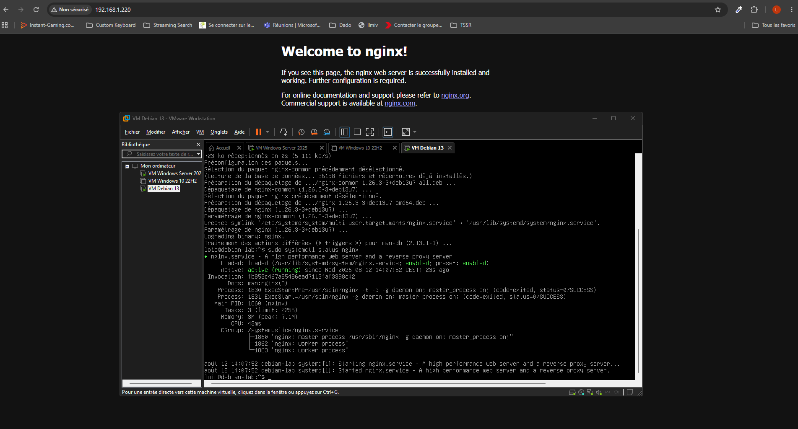
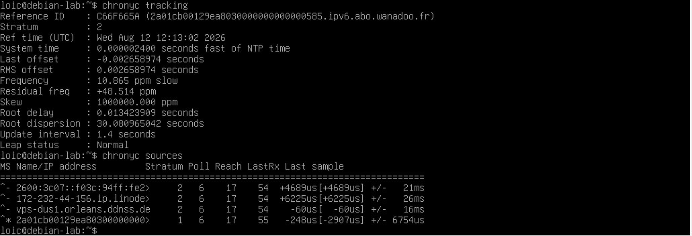
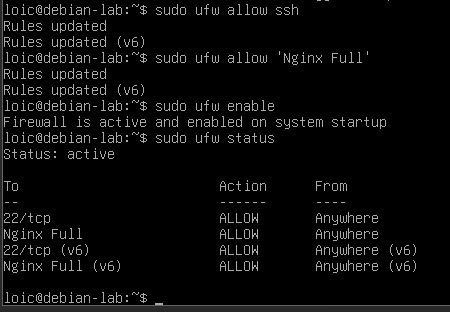

# Lab 1.4 — Installation des services Linux de base

## Objectif

Préparer et sécuriser la VM Debian 13 en installant et configurant les services système fondamentaux (Web, Synchronisation horaire et Sécurité). Ce laboratoire pose les bases indispensables pour le bon fonctionnement des labs futurs, notamment l'intégration Active Directory (qui requiert une synchronisation horaire parfaite) et le déploiement de la solution de supervision Zabbix prévue au lab 1.9.

## Étapes réalisées

1. **Mise à jour du système :** Actualisation des dépôts du gestionnaire de paquets de la Debian 13 via `sudo apt update`.

2. Configuration d'une adresse IP fixe sur la VM Debian (192.168.1.220), passerelle et DNS pointé vers le Windows Server (192.168.1.210), via `/etc/network/interfaces`

3. Sécurisation du service **SSH** : interdiction de la connexion directe en root (`PermitRootLogin no` dans `/etc/ssh/sshd_config`), redémarrage du service

4. **Déploiement du serveur Web (Nginx) :** Installation et activation de Nginx afin de préparer l'infrastructure qui servira de support visuel pour l'interface graphique du superviseur Zabbix au lab 1.9.

5. **Mise en place de la synchronisation horaire (Chrony) :** Installation du service Chrony. Configuration de ce dernier pour s'aligner précisément sur l'heure du contrôleur de domaine (Windows Server 2025). Cette étape est critique pour éviter que le protocole Kerberos ne rejette les futurs tickets d'authentification à cause d'un décalage temporel.

6. **Sécurisation par pare-feu (UFW) :** Installation de *Uncomplicated Firewall* (UFW) pour remplacer et simplifier la syntaxe native et complexe de Netfilter/Iptables.

7. **Configuration des règles de filtrage :** 
- Autorisation du port SSH standard (`sudo ufw allow 22/tcp`) pour conserver l'accès à distance.
- Ouverture des flux HTTP et HTTPS nécessaires pour Nginx (`sudo ufw allow 'Nginx Full'`).

8. **Activation du pare-feu :** Démarrage et application des règles au lancement du système via `sudo ufw enable`, suivi d'une vérification du statut avec `sudo ufw status`.

## Difficultés rencontrées

- **Résolution DNS en échec** (`apt update` renvoyait des erreurs de résolution pour `deb.debian.org` et les autres dépôts Debian), alors que la VM avait bien accès au réseau. Diagnostic en deux temps :

- Le **Windows Server** ne relayait pas encore les requêtes DNS externes : résolu en ajoutant un **redirecteur DNS** (forwarder, `8.8.8.8`) dans le Gestionnaire DNS du serveur, vérifié avec `nslookup deb.debian.org 192.168.1.210` puis `Resolve-DnsName` côté Windows

- Malgré ça, `apt update` échouait toujours : le fichier `/etc/resolv.conf` de la VM Debian était **vide**, la ligne `dns-nameservers` définie dans `/etc/network/interfaces` ne s'étant pas propagée automatiquement. Résolu en écrivant manuellement la ligne `nameserver 192.168.1.210` dans `/etc/resolv.conf`

- **Connexion accidentelle en root** pour installer certains paquets, alors que je voulais rester sur le compte `loic` avec `sudo`. `sudo` n'étant pas installé par défaut sur une Debian minimale, j'ai dû l'installer (`apt install sudo`) puis ajouter `loic` au groupe sudo (`usermod -aG sudo loic`) pour revenir à une utilisation correcte par la suite

## Ce que j'ai retenu

- La résolution DNS d'une VM peut échouer à deux niveaux différents (le serveur DNS lui-même, et la configuration locale de la machine) — un diagnostic efficace nécessite de vérifier les deux séparément plutôt que de supposer que le problème vient d'un seul endroit

- Un redirecteur DNS (forwarder) est indispensable dès qu'un serveur DNS interne (comme celui d'Active Directory) doit aussi permettre l'accès à des ressources externes à l'entreprise

- Sur une Debian minimale, `sudo` n'est pas installé par défaut — rester connecté en root en permanence est une mauvaise pratique à éviter, même quand c'est plus rapide sur le moment

- **L'importance de la synchronisation horaire avec Active Directory :** Le protocole Kerberos possède une tolérance maximale par défaut de 5 minutes de décalage entre les machines d'un domaine. L'installation de **Chrony** me garantit la stabilité des futurs raccordements de sécurité.

- **La simplification de l'administration pare-feu grâce à UFW :** L'utilisation de profils applicatifs natifs (comme `'Nginx Full'`) permet d'ouvrir simultanément et proprement les ports nécessaires (80 et 443) sans risque d'erreur humaine sur la syntaxe réseau. Avec `ufw`, l'ordre des opérations compte : toujours autoriser SSH avant d'activer le pare-feu, sous peine de se couper soi-même l'accès à distance

- **L'anticipation des besoins applicatifs :** Installer **Nginx** en amont me permet de valider les flux réseau Web à travers le pare-feu avant d'installer le superviseur Zabbix.

- **Prochaine étape (lab 1.5) :** Configuration et attribution des adresses IP statiques et du DNS pour ancrer définitivement la Debian dans le réseau local du laboratoire.