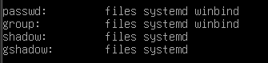
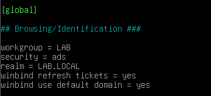
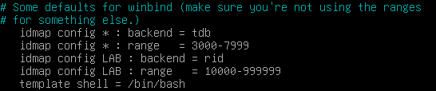
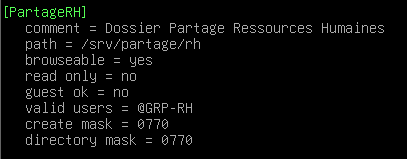
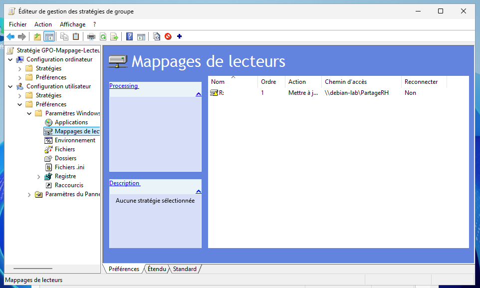

# Lab 1.6 — Serveur de fichiers Samba

## Objectif

Installer et configurer le service Samba sur la VM Debian 13 pour en faire un serveur de fichiers d'entreprise. L'objectif est d'intégrer pleinement cette machine Linux au domaine Active Directory (`lab.local`) afin de mettre en place le Single Sign-On (SSO) : permettre aux utilisateurs des unités d'organisation (OU) RH, Marketing et Communication d'accéder automatiquement à leurs dossiers partagés respectifs depuis le client Windows 10, de manière transparente et sans invite d'authentification secondaire.

## Étapes réalisées

1. Désactivation complète du protocole IPv6 sur la VM Windows Server et la VM Windows 10 pour éliminer les requêtes instables générées par la box internet en mode Pont (Bridged).
Pour la VM Debian 13 via le fichier `/etc/sysctl.conf` et la commande `sysctl -p`
```text
  net.ipv6.conf.all.disable_ipv6 = 1
  net.ipv6.conf.default.disable_ipv6 = 1
  net.ipv6.conf.lo.disable_ipv6 = 1
```

2. Installation des paquets Samba et du module d'authentification officiel de Microsoft pour Linux (**Winbind**) sur la Debian 13.
```bash
sudo apt update && sudo apt install samba samba-common-bin winbind libnss-winbind -y
```

3. Modification du fichier de configuration réseau `/etc/nsswitch.conf` pour ordonner au système d'exploitation Linux d'interroger Winbind pour la gestion des utilisateurs (`passwd`) et des groupes (`group`).\


4. Configuration de la section `[global]` du fichier `/etc/samba/smb.conf` : déclaration du domaine, activation de la sécurité `ads` (Active Directory), et mise en place du traducteur d'identité **RID** pour calculer automatiquement les UID/GID Linux à partir des SID Windows.



5. Création de l'arborescence des répertoires physiques sur le stockage Debian (`/srv/partage/rh`, `marketing`, `communication`) et attribution de droits permissifs locaux pour déléguer la sécurité à l'Active Directory.
```bash
sudo mkdir -p /srv/partage/rh /srv/partage/marketing /srv/partage/communication
sudo chmod -R 777 /srv/partage/
```

6. Déclaration des partages sécurisés à la fin du fichier `smb.conf` en restreignant l'accès via le paramètre `valid users = @"LAB\nom-du-groupe"`.\


7. Génération d'un ticket Kerberos administrateur (`kinit`) et jonction officielle de la machine Linux au domaine Windows Server 2025 via la commande `net ads join`.
```bash
sudo kinit Administrateur@LAB.LOCAL
sudo net ads join -U Administrateur
sudo systemctl restart smbd winbind
```

8. Nettoyage de la pile d'authentification PAM via l'utilitaire graphique `pam-auth-update` pour décocher les résidus de SSSD et valider l'authentification Winbind.

9. Configuration d'une stratégie de groupe (GPO) sur le contrôleur de domaine Windows Server 2025 pour déployer automatiquement le lecteur réseau mappé `R:` (`\\debian-lab\PartageRH`) dans la session des utilisateurs de l'OU RH.


10. Tests de connexion et de création de fichiers en Single Sign-On depuis le poste client Windows 10 avec différents comptes du domaine.

## Difficultés rencontrées

- **Invite d'authentification persistante sur Windows 10 lors de l'accès au partage :** Lors des premiers tests en saisissant l'adresse IP (`\\192.168.1.220\PartageRH`), Windows affichait systématiquement une demande de mot de passe. Après plusieurs recherches, cela venait du fait que Windows bloque par défaut le Single Sign-On (SSO) et le transfert de jetons Kerberos transparent lorsqu'on cible une adresse IP brute, car il la considère hors zone de confiance. Résolu en ciblant obligatoirement le nom informatique complet de la machine (`\\debian-lab\PartageRH`) résolu par le DNS.

- **Accès refusé en cascade à cause d'une mauvaise cible de droits dans Samba :** J'avais configuré la ligne de restriction sous la forme `valid users = @"LAB\RH"`, en ciblant directement l'Unité Organisationnelle (OU) créée au lab 1.2. Après des heures de blocage, j'ai réalisé qu'une OU est un conteneur logique de rangement pour l'administrateur et non un objet de sécurité. Samba est incapable de l'interpréter pour accorder des droits d'accès. Résolu en adaptant la syntaxe dans Samba (`valid users = @"LAB\GRP-RH"`) en ciblant le Groupe de sécurité dans l'Active Directory (`GRP-RH`).

- **Conflit critique entre les modules de sécurité SSSD et Winbind :** Lors de la bascule d'architecture, la commande système `getent group` renvoyait une ligne totalement vide et Winbind refusait de démarrer (`FAILURE`). Le système PAM de la Debian tentait d'utiliser l'ancien cache corrompu de SSSD. Résolu en purgeant complètement le paquet SSSD (`apt purge`), en nettoyant intégralement le fichier `/etc/nsswitch.conf` des mentions `sss`, et en ajustant l'écran bleu de `pam-auth-update` pour forcer l'usage exclusif de Winbind.

- **Plantage du protocole réseau et erreur "Le nom réseau spécifié n'est plus disponible" :** Ce problème survenait dès que Windows 10 initiait la connexion. L'outil de vérification `testparm` a révélé des fautes de frappe bloquantes dans mon fichier `smb.conf` (un "s" en trop sur le paramètre `winbind lookup sid` et l'oubli d'un "m" sur le mot `comment`). Ces erreurs de syntaxe provoquaient le crash immédiat du processus `smbd` lors d'une requête d'authentification.

## Ce que j'ai retenu

- Samba est extrêmement sensible à la syntaxe et à la casse : une simple lettre manquante dans le fichier de configuration (`coment` au lieu de `comment`) peut faire crasher l'intégralité du service de partage sans avertissement explicite sur le poste client.

- En environnement Active Directory, on ne distribue jamais de droits d'accès ou de permissions à une Unité Organisationnelle (OU) : il faut impérativement passer par des **Groupes de sécurité** (sécurité globale), seuls objets capables de porter des jetons d'accès compris par des serveurs tiers comme Samba.

- Le Single Sign-On (SSO) exige un réseau parfait en laboratoire : la présence d'adresses IPv6 dynamiques distribuées par la box internet en mode Bridged perturbait la liaison LDAP/Kerberos entre la Debian et le Windows Server. Forcer l'utilisation exclusive de l'IPv4 statique est indispensable pour stabiliser l'authentification croisée.

- Windows intègre de lourdes restrictions de sécurité natives qui bloquent l'envoi d'identifiants de session transparents vers des adresses IP brutes. Pour qu'un environnement d'entreprise fonctionne, il faut s'appuyer à 100 % sur la résolution de noms DNS (`\\nom-serveur`).

- Prochaine étape (lab 1.7) : Politique de sauvegarde et tests de restauration